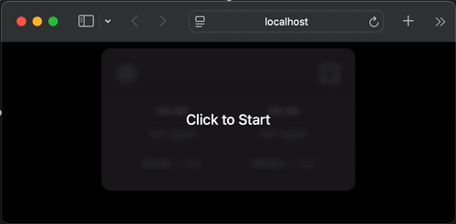

<div align="center">
  <a href="https://www.rouast.com/api/">
    
  </a>
  <h1>vitallens.js</h1>
  <p align="center">
    <p>Estimate vital signs such as heart rate, HRV, and respiratory rate from video in JavaScript.</p>
  </p>

[](https://github.com/Rouast-Labs/vitallens.js/actions/workflows/ci.yml)
[](https://www.npmjs.com/package/vitallens)
[![Website](https://img.shields.io/badge/Website-rouast.com/api-blue.svg?logo=data:image/svg%2bxml;base64,PD94bWwgdmVyc2lvbj0iMS4wIiBlbmNvZGluZz0iVVRGLTgiIHN0YW5kYWxvbmU9Im5vIj8+CjwhRE9DVFlQRSBzdmcgUFVCTElDICItLy9XM0MvL0RURCBTVkcgMS4xLy9FTiIgImh0dHA6Ly93d3cudzMub3JnL0dyYXBoaWNzL1NWRy8xLjEvRFREL3N2ZzExLmR0ZCI+Cjxzdmcgd2lkdGg9IjEwMCUiIGhlaWdodD0iMTAwJSIgdmlld0JveD0iMCAwIDI0IDI0IiB2ZXJzaW9uPSIxLjEiIHhtbG5zPSJodHRwOi8vd3d3LnczLm9yZy8yMDAwL3N2ZyIgeG1sbnM6eGxpbms9Imh0dHA6Ly93d3cudzMub3JnLzE5OTkveGxpbmsiIHhtbDpzcGFjZT0icHJlc2VydmUiIHhtbG5zOnNlcmlmPSJodHRwOi8vd3d3LnNlcmlmLmNvbS8iIHN0eWxlPSJmaWxsLXJ1bGU6ZXZlbm9kZDtjbGlwLXJ1bGU6ZXZlbm9kZDtzdHJva2UtbGluZWpvaW46cm91bmQ7c3Ryb2tlLW1pdGVybGltaXQ6MjsiPgogICAgPGcgdHJhbnNmb3JtPSJtYXRyaXgoMC4xODc5OTgsMCwwLDAuMTg3OTk4LDIzLjMyOTYsMTIuMjQ1MykiPgogICAgICAgIDxwYXRoIGQ9Ik0wLC0yLjgyOEMwLjMzOSwtMi41OTYgMC42NzQsLTIuMzk3IDEuMDA1LC0yLjIyNkwzLjU2NiwtMTUuODczQzAuMjY5LC0yMy42NTYgLTMuMTc1LC0zMS42MTUgLTkuNjU1LC0zMS42MTVDLTE2LjQ2MiwtMzEuNjE1IC0xNy41NDgsLTIzLjk0MiAtMTkuOTQ3LDAuMzEyQy0yMC40MjEsNS4wODEgLTIxLjAzOCwxMS4zMDggLTIxLjcxMSwxNi4wMzFDLTI0LjAxNiwxMS45NTQgLTI2LjY3NSw2LjU0OSAtMjguNDIsMy4wMDJDLTMzLjQ3OSwtNy4yNzggLTM0LjY2NSwtOS4zOTQgLTM2Ljg4OCwtMTAuNTM0Qy0zOS4wMzMsLTExLjYzOSAtNDAuOTk1LC0xMS41OTEgLTQyLjM3MSwtMTEuNDA4Qy00My4wMzcsLTEzIC00My45NDQsLTE1LjQzMSAtNDQuNjY4LC0xNy4zNjdDLTQ5LjUyOSwtMzAuMzkxIC01MS43NzIsLTM1LjQxMiAtNTYuMDY2LC0zNi40NTNDLTU3LjU2NiwtMzYuODE3IC01OS4xNDYsLTM2LjQ5MSAtNjAuMzk5LC0zNS41NjJDLTYzLjQyOCwtMzMuMzI0IC02NC4wMTYsLTI5LjYwMSAtNjUuNjUsLTIuMzcxQy02Ni4wMTcsMy43NDcgLTY2LjQ5NSwxMS43MTMgLTY3LjA1NiwxNy43NzZDLTY5LjE4MiwxNC4xMDggLTcxLjUyNiw5Ljc4MiAtNzMuMjY5LDYuNTcxQy04MS4wNTgsLTcuNzk0IC04Mi42ODcsLTEwLjQyMiAtODUuNzE5LC0xMS4zMUMtODcuNjQ2LC0xMS44NzcgLTg5LjIyMywtMTEuNjYgLTkwLjQyNSwtMTEuMjQ0Qy05MS4yOTYsLTEzLjM3NCAtOTIuNDM0LC0xNi45NzkgLTkzLjI1NSwtMTkuNTgzQy05Ni42LC0zMC4xODkgLTk4LjYyLC0zNi41ODggLTEwNC4xMzUsLTM2LjU4OEMtMTEwLjQ4NCwtMzYuNTg4IC0xMTAuODQzLC0zMC4zOTEgLTExMi4zNTUsLTQuMzExQy0xMTIuNzA3LDEuNzUgLTExMy4xNjksOS43NDIgLTExMy43NDEsMTUuNTUxQy0xMTYuMywxMS43ODEgLTExOS4yOSw2Ljk3OSAtMTIxLjQ1LDMuNDlMLTEyNC4wOTUsMTcuNTc2Qy0xMTcuNjA3LDI3LjU4NSAtMTE0Ljc2NiwzMC40NTggLTExMS4yMDQsMzAuNDU4Qy0xMDQuNjAzLDMwLjQ1OCAtMTA0LjIyMiwyMy44OTMgLTEwMi42MjEsLTMuNzQ3Qy0xMDIuNDIyLC03LjE3IC0xMDIuMTk3LC0xMS4wNDYgLTEwMS45NDYsLTE0LjcyOUMtOTkuNTUxLC03LjIxNiAtOTguMTkyLC0zLjY4NSAtOTUuNTQxLC0yLjA1Qy05Mi42OTgsLTAuMjk3IC05MC4zOTgsLTAuNTQ3IC04OC44MTMsLTEuMTU3Qy04Ny4wNCwxLjYyOSAtODQuMTExLDcuMDMgLTgxLjg0LDExLjIyQy03MS45NTUsMjkuNDQ2IC02OS4yMDIsMzMuNzM1IC02NC44NDYsMzMuOTc1Qy02NC42NjEsMzMuOTg1IC02NC40OCwzMy45ODkgLTY0LjMwNSwzMy45ODlDLTU4LjA2NCwzMy45ODkgLTU3LjY2MiwyNy4zMDQgLTU1LjkxNywtMS43ODdDLTU1LjYzMSwtNi41MyAtNTUuMywtMTIuMDcgLTU0LjkyNywtMTYuOTQ4Qy01NC41MTIsLTE1Ljg1MiAtNTQuMTI5LC0xNC44MjkgLTUzLjgwMywtMTMuOTU1Qy01MS4wNTYsLTYuNTk0IC01MC4xODcsLTQuNDExIC00OC40NzMsLTMuMDQyQy00NS44NywtMC45NjIgLTQzLjE0OSwtMS4zNjkgLTQxLjczNywtMS42MjhDLTQwLjYwMiwwLjMyOSAtMzguNjY0LDQuMjcxIC0zNy4xNjksNy4zMDZDLTI4LjgyNSwyNC4yNjQgLTI1LjE2OCwzMC42NzMgLTE5LjgxMiwzMC42NzNDLTEzLjE1NSwzMC42NzMgLTEyLjM2MiwyMi42NjYgLTEwLjI0NCwxLjI3MkMtOS42NjMsLTQuNjA2IC04Ljg4MiwtMTIuNDk2IC03Ljk5NiwtMTcuODMxQy02Ljk2MywtMTUuNzI5IC01Ljk1NCwtMTMuMzUgLTUuMzA3LC0xMS44MkMtMy4xNDUsLTYuNzIxIC0yLjAxNywtNC4yMDkgMCwtMi44MjgiIHN0eWxlPSJmaWxsOnJnYigwLDE2NCwyMjQpO2ZpbGwtcnVsZTpub256ZXJvOyIvPgogICAgPC9nPgo8L3N2Zz4K)](https://www.rouast.com/api/)
[![Documentation](https://img.shields.io/badge/Docs-docs.rouast.com-blue.svg?logo=data:image/svg%2bxml;base64,PD94bWwgdmVyc2lvbj0iMS4wIiBlbmNvZGluZz0iVVRGLTgiIHN0YW5kYWxvbmU9Im5vIj8+CjwhRE9DVFlQRSBzdmcgUFVCTElDICItLy9XM0MvL0RURCBTVkcgMS4xLy9FTiIgImh0dHA6Ly93d3cudzMub3JnL0dyYXBoaWNzL1NWRy8xLjEvRFREL3N2ZzExLmR0ZCI+Cjxzdmcgd2lkdGg9IjEwMCUiIGhlaWdodD0iMTAwJSIgdmlld0JveD0iMCAwIDI0IDI0IiB2ZXJzaW9uPSIxLjEiIHhtbG5zPSJodHRwOi8vd3d3LnczLm9yZy8yMDAwL3N2ZyIgeG1sbnM6eGxpbms9Imh0dHA6Ly93d3cudzMub3JnLzE5OTkveGxpbmsiIHhtbDpzcGFjZT0icHJlc2VydmUiIHhtbG5zOnNlcmlmPSJodHRwOi8vd3d3LnNlcmlmLmNvbS8iIHN0eWxlPSJmaWxsLXJ1bGU6ZXZlbm9kZDtjbGlwLXJ1bGU6ZXZlbm9kZDtzdHJva2UtbGluZWpvaW46cm91bmQ7c3Ryb2tlLW1pdGVybGltaXQ6MjsiPgogICAgPGcgdHJhbnNmb3JtPSJtYXRyaXgoMC4xODc5OTgsMCwwLDAuMTg3OTk4LDIzLjMyOTYsMTIuMjQ1MykiPgogICAgICAgIDxwYXRoIGQ9Ik0wLC0yLjgyOEMwLjMzOSwtMi41OTYgMC42NzQsLTIuMzk3IDEuMDA1LC0yLjIyNkwzLjU2NiwtMTUuODczQzAuMjY5LC0yMy42NTYgLTMuMTc1LC0zMS42MTUgLTkuNjU1LC0zMS42MTVDLTE2LjQ2MiwtMzEuNjE1IC0xNy41NDgsLTIzLjk0MiAtMTkuOTQ3LDAuMzEyQy0yMC40MjEsNS4wODEgLTIxLjAzOCwxMS4zMDggLTIxLjcxMSwxNi4wMzFDLTI0LjAxNiwxMS45NTQgLTI2LjY3NSw2LjU0OSAtMjguNDIsMy4wMDJDLTMzLjQ3OSwtNy4yNzggLTM0LjY2NSwtOS4zOTQgLTM2Ljg4OCwtMTAuNTM0Qy0zOS4wMzMsLTExLjYzOSAtNDAuOTk1LC0xMS41OTEgLTQyLjM3MSwtMTEuNDA4Qy00My4wMzcsLTEzIC00My45NDQsLTE1LjQzMSAtNDQuNjY4LC0xNy4zNjdDLTQ5LjUyOSwtMzAuMzkxIC01MS43NzIsLTM1LjQxMiAtNTYuMDY2LC0zNi40NTNDLTU3LjU2NiwtMzYuODE3IC01OS4xNDYsLTM2LjQ5MSAtNjAuMzk5LC0zNS41NjJDLTYzLjQyOCwtMzMuMzI0IC02NC4wMTYsLTI5LjYwMSAtNjUuNjUsLTIuMzcxQy02Ni4wMTcsMy43NDcgLTY2LjQ5NSwxMS43MTMgLTY3LjA1NiwxNy43NzZDLTY5LjE4MiwxNC4xMDggLTcxLjUyNiw5Ljc4MiAtNzMuMjY5LDYuNTcxQy04MS4wNTgsLTcuNzk0IC04Mi42ODcsLTEwLjQyMiAtODUuNzE5LC0xMS4zMUMtODcuNjQ2LC0xMS44NzcgLTg5LjIyMywtMTEuNjYgLTkwLjQyNSwtMTEuMjQ0Qy05MS4yOTYsLTEzLjM3NCAtOTIuNDM0LC0xNi45NzkgLTkzLjI1NSwtMTkuNTgzQy05Ni42LC0zMC4xODkgLTk4LjYyLC0zNi41ODggLTEwNC4xMzUsLTM2LjU4OEMtMTEwLjQ4NCwtMzYuNTg4IC0xMTAuODQzLC0zMC4zOTEgLTExMi4zNTUsLTQuMzExQy0xMTIuNzA3LDEuNzUgLTExMy4xNjksOS43NDIgLTExMy43NDEsMTUuNTUxQy0xMTYuMywxMS43ODEgLTExOS4yOSw2Ljk3OSAtMTIxLjQ1LDMuNDlMLTEyNC4wOTUsMTcuNTc2Qy0xMTcuNjA3LDI3LjU4NSAtMTE0Ljc2NiwzMC40NTggLTExMS4yMDQsMzAuNDU4Qy0xMDQuNjAzLDMwLjQ1OCAtMTA0LjIyMiwyMy44OTMgLTEwMi42MjEsLTMuNzQ3Qy0xMDIuNDIyLC03LjE3IC0xMDIuMTk3LC0xMS4wNDYgLTEwMS45NDYsLTE0LjcyOUMtOTkuNTUxLC03LjIxNiAtOTguMTkyLC0zLjY4NSAtOTUuNTQxLC0yLjA1Qy05Mi42OTgsLTAuMjk3IC05MC4zOTgsLTAuNTQ3IC04OC44MTMsLTEuMTU3Qy04Ny4wNCwxLjYyOSAtODQuMTExLDcuMDMgLTgxLjg0LDExLjIyQy03MS45NTUsMjkuNDQ2IC02OS4yMDIsMzMuNzM1IC02NC44NDYsMzMuOTc1Qy02NC42NjEsMzMuOTg1IC02NC40OCwzMy45ODkgLTY0LjMwNSwzMy45ODlDLTU4LjA2NCwzMy45ODkgLTU3LjY2MiwyNy4zMDQgLTU1LjkxNywtMS43ODdDLTU1LjYzMSwtNi41MyAtNTUuMywtMTIuMDcgLTU0LjkyNywtMTYuOTQ4Qy01NC41MTIsLTE1Ljg1MiAtNTQuMTI5LC0xNC44MjkgLTUzLjgwMywtMTMuOTU1Qy01MS4wNTYsLTYuNTk0IC01MC4xODcsLTQuNDExIC00OC40NzMsLTMuMDQyQy00NS44NywtMC45NjIgLTQzLjE0OSwtMS4zNjkgLTQxLjczNywtMS42MjhDLTQwLjYwMiwwLjMyOSAtMzguNjY0LDQuMjcxIC0zNy4xNjksNy4zMDZDLTI4LjgyNSwyNC4yNjQgLTI1LjE2OCwzMC42NzMgLTE5LjgxMiwzMC42NzNDLTEzLjE1NSwzMC42NzMgLTEyLjM2MiwyMi42NjYgLTEwLjI0NCwxLjI3MkMtOS42NjMsLTQuNjA2IC04Ljg4MiwtMTIuNDk2IC03Ljk5NiwtMTcuODMxQy02Ljk2MywtMTUuNzI5IC01Ljk1NCwtMTMuMzUgLTUuMzA3LC0xMS44MkMtMy4xNDUsLTYuNzIxIC0yLjAxNywtNC4yMDkgMCwtMi44MjgiIHN0eWxlPSJmaWxsOnJnYigwLDE2NCwyMjQpO2ZpbGwtcnVsZTpub256ZXJvOyIvPgogICAgPC9nPgo8L3N2Zz4K)](https://docs.rouast.com/)

</div>

`vitallens.js` is the official JavaScript client for the [**VitalLens API**](https://www.rouast.com/api/), a service for estimating physiological vital signs like heart rate, respiratory rate, and heart rate variability (HRV) from facial video.

<div align="center">
  
</div>

Using a different language or platform? We also have a [Python client](https://github.com/Rouast-Labs/vitallens-python) and [iOS app](https://apps.apple.com/us/app/vitallens/id6472757649).

## Features

- **Cross-Platform Compatibility:**  
  Use vitallens.js in the browser or Node.js.

- **Flexible Input Support:**
  Process video files or live streams from a webcam or any MediaStream.

- **Multiple Estimation Methods:**
  Choose the method that fits your needs:
  - **`vitallens`**: Provides *heart rate*, *respiratory rate*, and *heart rate variability* estimates. *(Automatically selects the best available model for your plan. Requires an API key - [get one for free on our website](https://www.rouast.com/api/))*
  - **`g`**, **`chrom`**, **`pos`**: Offer less accurate *heart rate* estimates. *(No API key required.)*

- **Fast Face Detection & ROI Support:**  
  Perform rapid face detection when required—or optionally, pass a global region of interest (ROI) to skip detection for even faster processing.

- **Pre-Built Web Component Widgets:**  
  In addition to the core API, vitallens.js provides ready-to-use web components. Try our simple vitals monitor widget (as seen in the above gif), or use an advanced widget showing vitals, video, and waveforms (supports both file and webcam modes).

## Installation

### Node.js

Install `vitallens.js` via npm or yarn:

```bash
npm install vitallens
# or
yarn add vitallens
```

Then use it as follows:

```js
import { VitalLens } from 'vitallens';
const vl = new VitalLens({ method: 'vitallens', apiKey: 'YOUR_API_KEY' });
const result = await vl.processVideoFile(myVideoFile);
console.log(result);
```

### Browser

For browser usage, you have two options: using the pre-built Web Components or importing the core `VitalLens` class directly.

**Option 1: Using the Web Components (Recommended)**

This is the easiest way to get started. Just add the module script from a CDN, and you can use the custom elements directly in your HTML.

```html
<script type="module" src="https://cdn.jsdelivr.net/npm/vitallens/dist/vitallens.browser.js"></script>

<!-- Easy-to-use vitals monitor with basic readings -->
<vitallens-vitals-monitor api-key="YOUR_API_KEY"></vitallens-vitals-monitor>

<!-- Advanced widget. Supports both file and webcam inputs, video and waveform views -->
<vitallens-widget api-key="YOUR_API_KEY"></vitallens-widget>
```

**Option 2: Using the Core API**

If you need more control, you can import the `VitalLens` class directly into your own JavaScript module.

```html
<video id="my-video" autoplay muted playsinline></video>

<script type="module">
  // Import latest version from jsDelivr (recommended)
  import { VitalLens } from 'https://cdn.jsdelivr.net/npm/vitallens';

  // Or pin a specific version:
  // import { VitalLens } from 'https://cdn.jsdelivr.net/npm/vitallens@0.2.3';
  
  // Or use Skypack:
  // import { VitalLens } from 'https://cdn.skypack.dev/vitallens';

  (async () => {
    try {
      const videoElement = document.getElementById('my-video');
      const stream = await navigator.mediaDevices.getUserMedia({ video: true });
      videoElement.srcObject = stream;

      const vl = new VitalLens({ method: 'vitallens', apiKey: 'YOUR_API_KEY' });

      await vl.setVideoStream(stream, videoElement); // Use await here
      vl.addEventListener('vitals', (data) => console.log(data));
      vl.startVideoStream();
    } catch (err) {
      console.error("Failed to start VitalLens:", err);
    }
  })();
</script>
```

## How to use

### Configuring `VitalLens`

When creating a new `VitalLens` instance, you can configure various options:

| Parameter           | Description                                                                                | Default        |
| ------------------- | ------------------------------------------------------------------------------------------ | -------------- |
| `method`            | Inference method: `vitallens`, `g`, `chrom`, or `pos`.                                     | `vitallens`    |
| `apiKey`            | API key for the VitalLens API (required for method `vitallens`).                           | `null`         |
| `globalRoi`         | Optional region of interest for face detection (object with `{ x0, y0, x1, y1 }`).         | `undefined`    |
| `waveformMode`      | Optional setting how waveform is returned: `incremental`, `windowed`, or `complete`.       | *(see below)*  |
| `overrideFpsTarget` | Override for the target frames per second (fps) used during inference.                     | `undefined`    |
| `fDetFs`            | Frequency (in Hz) at which face detection should be performed.                             | `1`            |

The default value for `waveformMode` is `windowed` if a stream is being analyzed, and `complete` if a file is being processed.

### Methods

You can choose from several rPPG methods:
- `vitallens`: The recommended method. Uses the VitalLens API and automatically selects the best model for your API key (e.g., VitalLens 2.0 with HRV support)
- `vitallens-2.0`: Forces the use of the VitalLens 2.0 model.
- `vitallens-1.0`: Forces the use of the VitalLens 1.0 model.
- `vitallens-1.1`: Forces the use of the VitalLens 1.1 model.
- `pos`, `chrom`, `g`: Classic rPPG algorithms that run locally and do not require an API key.

### Understanding the results

#### When analyzing a video stream

When analyzing a video stream, `VitalLens` returns estimation results continuously. Each returned estimation result contains the following vital signs:

| Name                   | Type                | Based on / containing     | Returned if                                                                                         |
|------------------------|---------------------|---------------------------|-----------------------------------------------------------------------------------------------------|
| `ppg_waveform`         | Continuous waveform | Depends on `waveformMode` | Always                                                                                              |
| `heart_rate`           | Global value        | Up to last 10 seconds     | Face present for at least 5 seconds                                                                 |
| `respiratory_waveform` | Continuous waveform | Depends on `waveformMode` | Using `vitallens`, `vitallens-1.0`, `vitallens-1.1`, or `vitallens-2.0`                             |
| `respiratory_rate`     | Global value        | Up to last 30 seconds     | Face present for at least 10 seconds using `vitallens`, `vitallens-1.0`, `vitallens-1.1`, or `vitallens-2.0` |
| `hrv_sdnn`             | Global value        | Up to last 60 seconds     | Face present for at least 20 seconds using `vitallens`, or `vitallens-2.0`                          |
| `hrv_rmssd`            | Global value        | Up to last 60 seconds     | Face present for at least 20 seconds using `vitallens`, or `vitallens-2.0`                          |
| `hrv_lfhf`             | Global value        | Up to last 60 seconds     | Face present for at least 55 seconds using `vitallens`, or `vitallens-2.0`                          |

#### When analyzing a video file

When analyzing a video file, `VitalLens` returns one estimation result for the entire file, containing:

| Name                   | Type                | Based on / containing     | Returned if                                                                                         |
|------------------------|---------------------|---------------------------|-----------------------------------------------------------------------------------------------------|
| `ppg_waveform`         | Continuous waveform | Depends on `waveformMode` | Always                                                                                              |
| `heart_rate`           | Global value        | Entire video              | Video is at least 5 seconds long                                                                    |
| `respiratory_waveform` | Continuous waveform | Depends on `waveformMode` | Using `vitallens`, `vitallens-1.0`, `vitallens-1.1`, or `vitallens-2.0`                             |
| `respiratory_rate`     | Global value        | Entire video              | Video is at least 10 seconds long using `vitallens`, `vitallens-1.0`, `vitallens-1.1`, or `vitallens-2.0` |
| `hrv_sdnn`             | Global value        | Entire video              | Face present for at least 20 seconds using `vitallens`, or `vitallens-2.0`                          |
| `hrv_rmssd`            | Global value        | Entire video              | Face present for at least 20 seconds using `vitallens`, or `vitallens-2.0`                          |
| `hrv_lfhf`             | Global value        | Entire video              | Face present for at least 55 seconds using `vitallens`, or `vitallens-2.0`                          |

The library returns vital sign estimates in a structured object. **vitallens.js is designed to process only a single face** — so you always receive a single result object with the following structure:

```typescript
export interface VitalLensResult {
  face: {
    // Detected face coordinates for each frame, formatted as [x0, y0, x1, y1].
    coordinates: Array<[number, number, number, number]>;
    // Confidence values for the face per frame.
    confidence: number[];
    // An explanatory note regarding the face detection.
    note: string;
  };
  vital_signs: {
    // Estimated global heart rate.
    heart_rate: {
      // Estimated heart rate value.
      value: number;
      // Unit of the heart rate value.
      unit: string;
      // Overall confidence of the heart rate estimation.
      confidence: number;
      // An explanatory note regarding the estimation.
      note: string;
    };
    // Other vitals...
  };
  // A list of timestamps (one per processed frame).
  time: number[];
  // The frames per second (fps) of the input video.
  fps: number;
  // The effective fps used for inference.
  estFps: number;
  // A message providing additional information about the estimation.
  message: string;
}
```

### Core API Lifecycle: Managing the Instance

When using the core `VitalLens` class, you are responsible for managing the instance's lifecycle. This involves controlling the stream and listening for events.

#### 1. Controlling the Stream

You can control a live video stream at any time using these methods:

  * **`vl.startVideoStream()`**: Starts or resumes processing.
  * **`vl.pauseVideoStream()`**: Pauses processing. The webcam stays on, but no new data is sent.
  * **`vl.stopVideoStream()`**: Stops processing, stops the webcam, and clears all internal buffers.

```js
// Example: A simple pause/resume button
let isProcessing = true;
myButton.onclick = () => {
if (isProcessing) {
  vl.pauseVideoStream();
  myButton.textContent = 'Resume';
} else {
  vl.startVideoStream();
  myButton.textContent = 'Pause';
}
isProcessing = !isProcessing;
};
```

#### 2. Listening for Events

Your application should listen for events to receive data and handle errors.

  * **`vitals` (On Success)**
    This event fires continuously during a stream whenever a new vital sign packet is ready.

```js
vitallens.addEventListener('vitals', (result) => {
  console.log('Vitals:', result);
  // Update your UI here
});
```

  * **`streamReset` (On Recoverable Error)**
    This event fires if the network becomes too unstable. The library logs a `VitalLensAPIError` for debugging, stops the stream to prevent a crash, and emits this event. Your application should listen for this to handle the reset.

    **Best Practice:** Listen for this event, notify the user, and automatically restart the stream.

```js
vitallens.addEventListener('streamReset', (eventData) => {
  console.warn('Stream was reset:', eventData.message);
  
  // 1. Notify user and stop the old stream
  showMyErrorPopup('Connection unstable. Reconnecting...');
  vl.stopVideoStream();

  // 2. Wait 3 seconds and restart
  setTimeout(async () => {
    try {
      const stream = await navigator.mediaDevices.getUserMedia({ video: true });
      videoElement.srcObject = stream;
      await vl.setVideoStream(stream, videoElement);
      vl.startVideoStream();
      hideMyErrorPopup();
    } catch (err) {
      console.error('Failed to restart stream:', err);
      showMyErrorPopup('Could not reconnect. Please try again manually.');
    }
  }, 3000);
});
```

  * **`fileProgress` (File Processing)**
    This event fires multiple times when calling `processVideoFile` to provide text updates on the processing stages.

```js
vitallens.addEventListener('fileProgress', (message) => {
  console.log('File progress:', message); // e.g., "Detecting faces..."
  showLoadingSpinner(message);
});
```

## Examples

Before running any of the examples, make sure to build the project by executing:

```bash
npm run build
```

Also, note that each example requires an API key. Replace `YOUR_API_KEY` with your actual API key when running the examples.

- **Browser - Vitals Monitor:**
  [examples/browser/vitals_monitor.html](examples/browser/vitals_monitor.html)  
  To run this example, execute:
  ```bash
  API_KEY=YOUR_API_KEY npm run start:browser
  ```

- **Browser - Advanced Widget:**
  [examples/browser/widget.html](examples/browser/widget.html)  
  To run this example, execute:
  ```bash
  API_KEY=YOUR_API_KEY npm run start:browser-widget
  ```

- **Browser - Minimal File Input:**
  [examples/browser/file_minimal.html](examples/browser/file_minimal.html)  
  To run this example, execute:
  ```bash
  API_KEY=YOUR_API_KEY npm run start:browser-file-minimal
  ```

- **Browser - Minimal Webcam Input:**
  [examples/browser/webcam_minimal.html](examples/browser/webcam_minimal.html)  
  To run this example, execute:
  ```bash
  API_KEY=YOUR_API_KEY npm run start:browser-webcam-minimal
  ```

- **Node - File Processing:**
  [examples/node/file.js](examples/node/file.js)  
  To run this example, execute:
  ```bash
  API_KEY=YOUR_API_KEY npm run start:node-file
  ```

Try opening the HTML examples in your browser or running the Node script to see `vitallens.js` in action.

## Troubleshooting

* **Error in Chrome: `Refused to cross-origin redirects...`** This error occurs for some browsers when opening the HTML file directly from your computer, because browser security policies prevent advanced features from running in HTML files opened directly from your computer.
  **Solution:** Serve your HTML file from a local web server. In your file's directory, run:

  ```bash
  npx serve
  ```

* **When to Use the Self-Contained Library** Use the self-contained library if your app must run in an environment that blocks requests to public CDNs (like an offline app or behind a corporate firewall).
  **Warning:** This file is large and will significantly slow initial page load.

  ```html
  <script src="https://cdn.jsdelivr.net/npm/vitallens@0.2.0/dist/vitallens.browser.selfcontained.js"></script>
  ```

## Securing your API Key

For security reasons, we recommend that you do not expose your API key directly in client-side code. There are two primary approaches to secure your API key:

### 1. Run Everything on your Server

If you are building a server-side application using Node.js, your API key remains securely on your server. Simply call the API directly from your backend code without exposing your credentials.

### 2. Use a Proxy Server for Client-Side Code

If you need to use `vitallens.js` in a browser, you can set up a proxy server. The proxy server receives requests from the client, attaches your API key (stored securely on the server), and forwards the request to the VitalLens API. This way, the API key is never exposed to the client.

Our client library supports this by accepting a `proxyUrl` option. For example:

```js
import { VitalLens } from 'vitallens';
const vl = new VitalLens({
  method: 'vitallens',
  proxyUrl: 'https://your-proxy-server.com/api' // URL to your deployed proxy server
});
```

Or when using one of our widgets:

```html
<vitallens-widget proxy-url="https://your-proxy-server.com/api"></vitallens-widget>
```

### Sample Proxy Server Implementation

Below is a simple Node.js/Express proxy server implementation that you can use as a starting point:

```js
const express = require('express');
const bodyParser = require('body-parser');
const cors = require('cors');

const app = express();
const PORT = process.env.PORT || 3000;

// Securely store your API key in an environment variable
const API_KEY = process.env.VITALLENS_API_KEY;
const VITALLENS_ENDPOINT = 'https://api.rouast.com/vitallens-v3/file';

app.use(bodyParser.json({ limit: '10mb' }));

// Enable CORS for your allowed domain.
app.use(cors({
  origin: 'http://example.com', // Your allowed domain
  methods: ['GET', 'POST', 'OPTIONS'],
  allowedHeaders: ['Content-Type', 'Authorization']
}));

app.post('/', async (req, res) => {
  try {
    const response = await fetch(VITALLENS_ENDPOINT, {
      method: 'POST',
      headers: {
        'Content-Type': 'application/json',
        'x-api-key': API_KEY,
      },
      body: JSON.stringify(req.body),
    });
    const data = await response.text();
    res.status(response.status).send(data);
  } catch (error) {
    console.error('Proxy error:', error);
    res.status(500).send('Internal server error');
  }
});

app.listen(PORT, () => {
  console.log(`Proxy server listening on port ${PORT}`);
});
```

You can deploy this proxy server on any Node.js hosting platform (such as Heroku, Vercel, or your own server) and then set the URL as the `proxyUrl` in your VitalLens client configuration.

## Development

### Building the Library

To build the project from source, run:

```bash
npm run build
```

This compiles the TypeScript source and bundles the output for Node (both ESM and CommonJS), and the browser.

### Running Tests

Execute the test suite with:

```bash
npm run test
```

For environment-specific tests, you can use:

```bash
npm run test:browser
npm run test:node
npm run test:browser-integration
npm run test:node-integration
```

Run specific tests:

```bash
npx jest test/core/VitalLens.browser.test.ts
```

### Linting

Lint the code using:

```bash
npm run lint
```

## Disclaimer

**Important:** vitallens.js provides vital sign estimates for general wellness purposes only. It is **not intended for medical use**. Always consult a healthcare professional for any medical concerns or precise clinical measurements.

Please review our [Terms of Service](https://www.rouast.com/api/terms) and [Privacy Policy](https://www.rouast.com/privacy) for more details.

## License

This project is licensed under the [MIT License](LICENSE).
